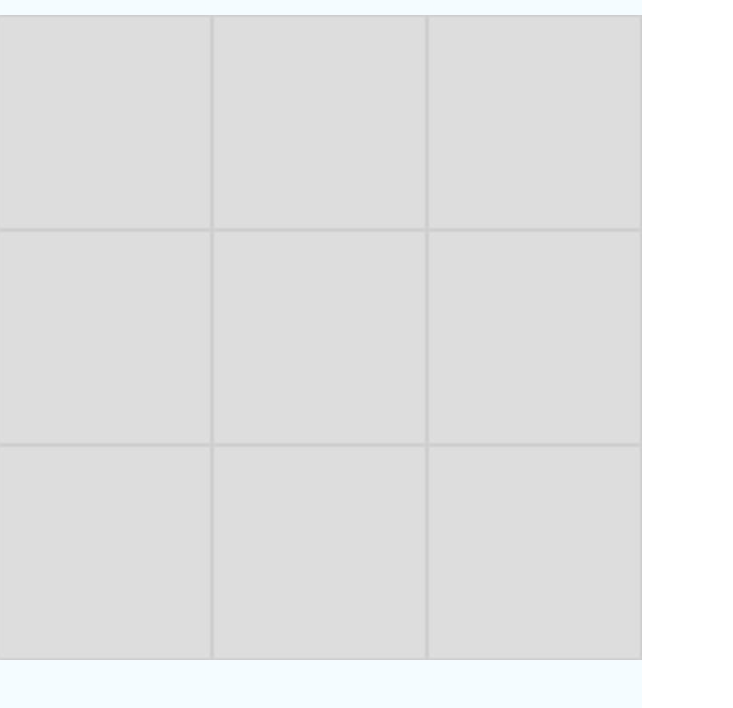

# App_Jogo-Da-Velha
App de jogo da velha para Android e IOS utilizando React Native.
**Palavras chave:** JavaScript, React Native.

### Pagina Inicial do Jogo


### Durante a partida


### Fim de jogo


## Pré-requisitos
```
Ter instalado o React Native com todas suas dependências.
```

## Construído com
* [Visual Studio Code](https://code.visualstudio.com/) - O editor utilizado.
* [Vídeo](https://www.youtube.com/watch?v=8pDQ13MQQZo) - O vídeo que serviu como base para essa implementação.


## Versões
VERSÃO 1.0.0
* O app ainda não possui opção de rejogar.
* Contador de vitórias ainda não implementado

## Autor
* **Igor Vitor Vieira** - [IgorVVieira](https://github.com/IgorVViera)
